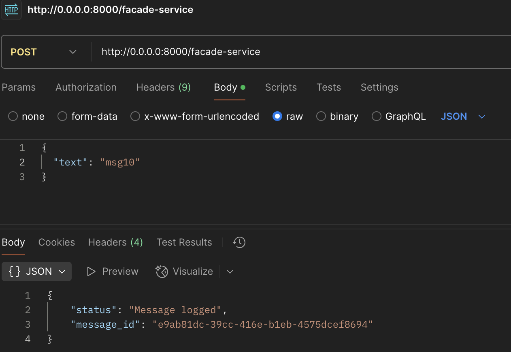
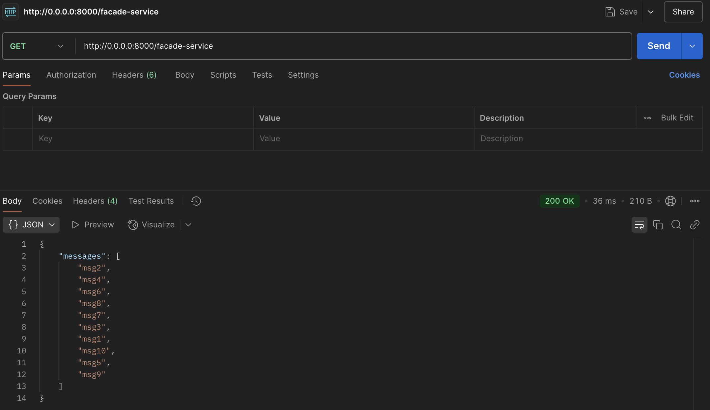
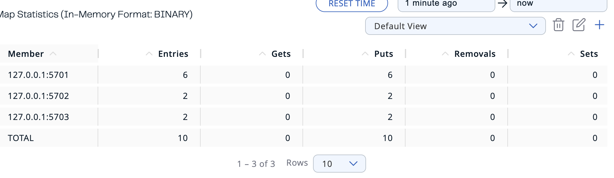
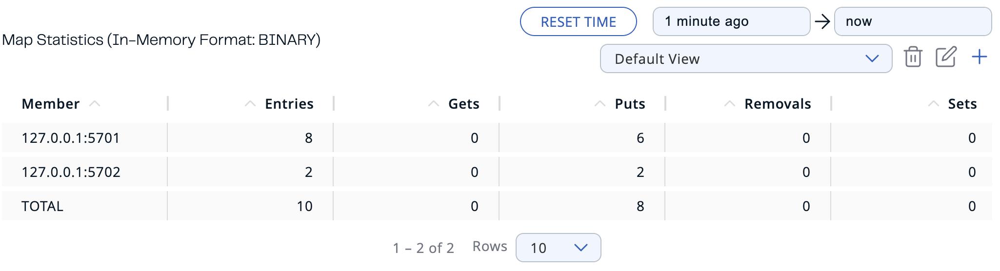
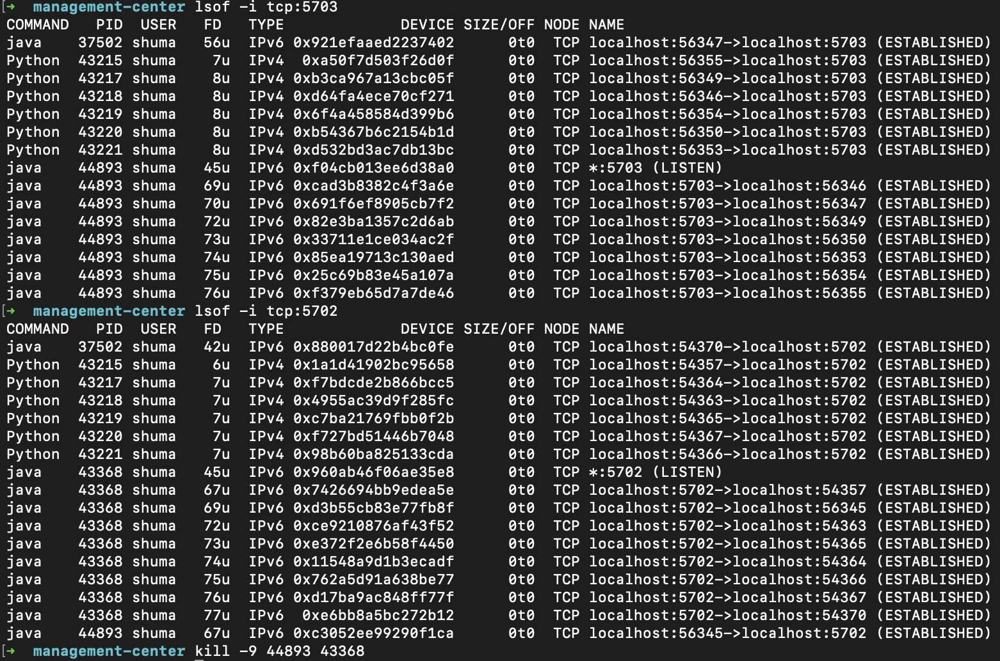
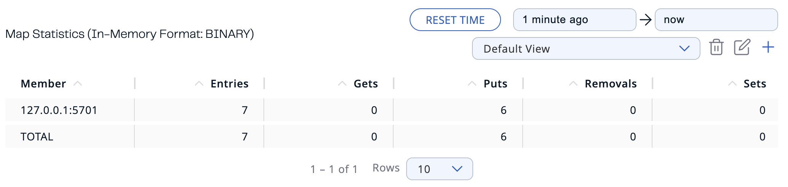
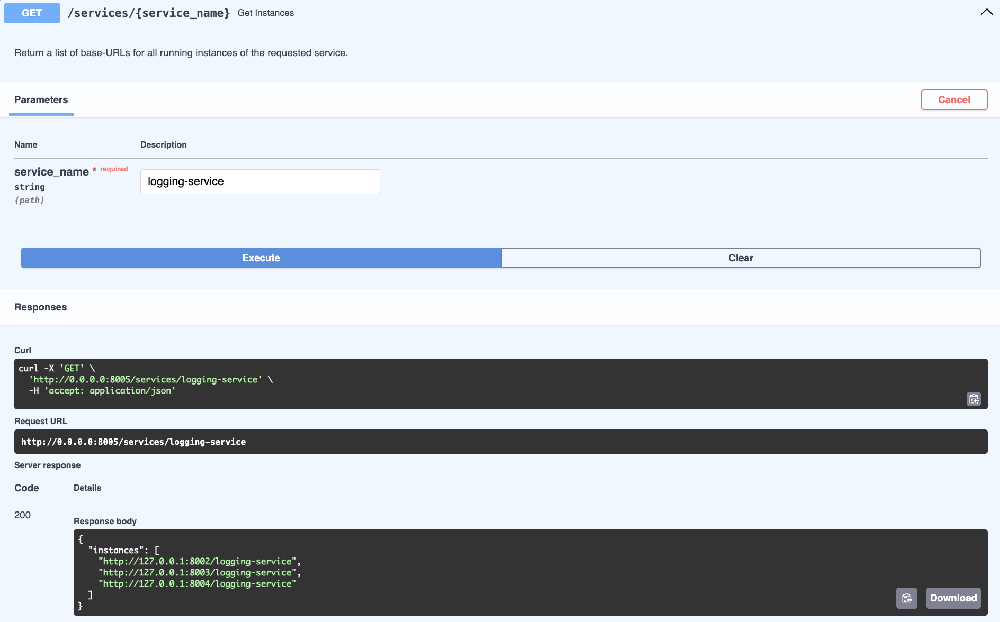
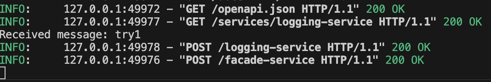

# software-architecture-lab3

### Step: 1
After running all services, we send 10 messages using HTTP POST requests to the facade-service.

### Step: 2
The messages are distributed randomly among the available logging-service instances.

### Step: 3
In the Management Center, we can see that all messages are distributed across three different Hazelcast maps.

### Step: 4
If we terminate one logging-service instance, the system rebalance the map, ensuring no data loss.

### Step: 5
Next, we terminate two logging-service instances at once.

### Step: 6
As a result, we can observe visible data loss.

# Additional
In my `config_server.py` facade-service will query to discover all active instances of any microservice by name.

Let's try config server

Here we can see that adresses are changed dynamically

